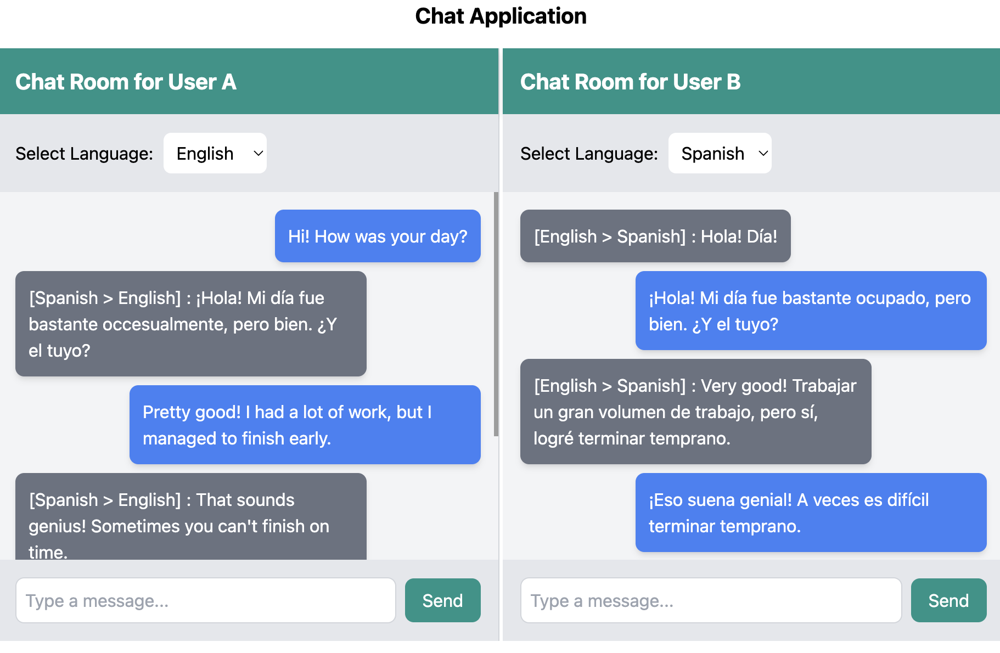

# Simple Chat Translation App

Simple Chat Translation App is a **React (TypeScript) & Go-based application** that translates messages between users using **LLM models** via the **Ollama API**. The frontend simulates **two chat windows**, where each user can select their preferred language, and every message sent is automatically **translated into the receiver's language**.



## Features

- **Real-Time Translation**: Messages are dynamically translated using an LLM model before being delivered to the receiver.
- **Two Chat Windows**: Users communicate in their preferred language, and the message is automatically translated.
- **Customizable Language Selection**: Each user can select their preferred language from the UI.
- **Configurable LLM Models**: Supports different models from **Ollama** (tested with `gemma2:2b` and `deepseek-r1:1.5b`).
- **Full-Stack Implementation**: Built with **React (TypeScript) for the frontend** and **Go for the backend**.

---

## Prerequisites

### **Install Ollama**
Ollama is required to run the chatbot models locally. Visit the [Ollama website](https://ollama.com/) and follow the installation instructions for your operating system.

### **Download and Start the Required Model**
Use Ollama’s CLI to download and start the chatbot models. For example:
```bash
ollama run gemma2:2b
```
Or, if you want to try another model:
```bash
ollama run deepseek-r1:1.5b
```

---

## Project Structure

| Folder/File                  | Description                                  |
|------------------------------|----------------------------------------------|
| `react-chat-frontend/src/components/ChatRoom.tsx`     | Chat component for message handling. |
| `react-chat-frontend/src/components/LanguageSelector.tsx` | Allows users to select their preferred language. |
| `react-chat-frontend/src/services`        | Handles API requests to the backend.        |
| `react-chat-frontend/.env`              | Stores environment variables.                |
| `go-chat-api/main.go`             | Entry point for the Go API.                  |
| `go-chat-api/routes.go`           | Defines API routes.                          |
| `go-chat-api/chat_handler.go`     | Handles message processing and translation.  |
| `go-chat-api/language_handler.go` | Manages user language selection.             |

---

## Installation

### **Backend Setup (Go API)**
1. Navigate to the backend folder:
   ```bash
   cd go-chat-api
   ```
2. Run the Go server:
   ```bash
   go run main.go
   ```

### **Frontend Setup (React)**
1. Navigate to the react-chat-frontend folder:
   ```bash
   cd react-chat
   ```
2. Create a `.env` file in the root and add the API URL:
   ```
   REACT_APP_CHAT_API=http://localhost:9090/api
   ```
3. Install dependencies:
   ```bash
   npm install
   ```
4. Start the React development server:
   ```bash
   npm run start
   ```

---


## **Usage**
1. Open the application in your browser at: `http://localhost:3000`.
2. Select your preferred language in each chat window.
3. Send a message in your language, and it will be translated to the recipient's language before appearing in their chat window.
4. Experiment with different **LLM models** (e.g., `gemma2:2b`, `deepseek-r1:1.5b`).

---

## **Configuring the LLM Model for Translation**
The translation behavior is defined in the **Go backend** (`go-chat-api/ollama/client.go`). You can change the model and prompt used for translation in the **Ollama API request**.

Example:
```go
payload := map[string]interface{}{
		"model": "deepseek-r1:1.5b", //"gemma2:2b" ,
		"messages": []map[string]string{
			{
				"role":    "user",
				"content": "could you translate this message written in " + senderLang + " to " + receiverLang + "? the message '" + message + "' **important** only response with the translated message",
			},
		},
		"stream": false,
	}
```

Feel free to **modify the prompt** and experiment with different LLM models.

---

## **Contributing**
If you’d like to contribute to this project, feel free to submit a pull request or open an issue!

---

## **License**
This project is licensed under the MIT License.

🚀 Enjoy experimenting with **LLM-powered message translation!** 🔥

